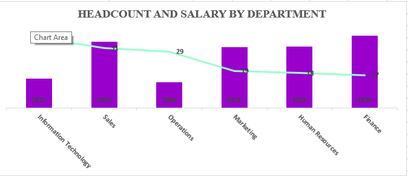
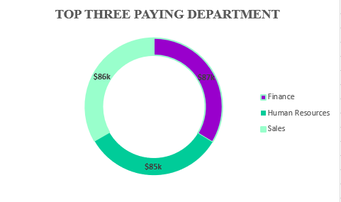
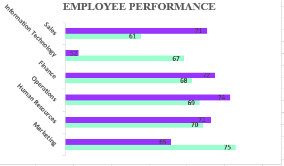
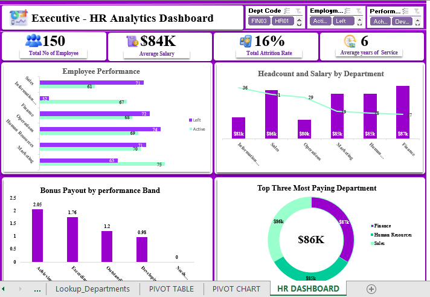

# HR Analytics Capstone Project - Data Processing & Dashboard

## Project Overview
This project involved cleaning and analyzing a raw HR dataset to build an interactive Excel dashboard. Starting from a messy and inconsistent file (`messy.xlsx`), the data was transformed into a reliable, cleaned version with supporting lookup tables, analysis, charts, and a final dashboard. The goal was to enable data-driven HR decision-making around headcount, compensation, performance, attrition, and bonuses.

## 1. Key Findings
- Total workforce: **150 employees** across 6 departments.
- Overall average salary: **~$83,743**.
- Overall attrition rate: **16%**.
- Total projected bonus payout: **$410,768**.
- Average performance scores are similar between Active and Left employees, suggesting other factors drive attrition.

## 2. Observations
Pivot table analysis of the cleaned dataset revealed several important patterns:
- Information Technology has the highest headcount (36 employees), while Operations shows the highest attrition rate among "Left" employees.
- Finance and Sales departments have the highest average salaries, yet do not necessarily correlate with lower attrition.
- Performance scores show minimal difference between Active and Left employees, indicating that low performance may not be the primary driver of attrition.
- Bonus payouts are heavily concentrated in the Achieving, Exceeding, and Outstanding performance bands, with Needs Improvement contributing zero.
- Tenure (Years of Service) varies significantly across departments, with potential links to compensation and retention trends visible in the pivot tables.

## 3. Insights
The following insights were generated:

- **Headcount & Salary**: Information Technology dominates headcount, while Finance and Sales lead in average compensation.

---

- **Top three paying departments**: Finace department followed by human resourses and sales department pay the most. Full department-wise view is in the screenshot.

---

- **Performance**: Active (~67.9) and Left (~66.1) employees have similar averages; Resigned employees scored higher.

---

- **Bonus Distribution**: Majority of the $410,768 total bonus is allocated to top three performance bands.
!Bonus Payout by Performance Band](HR images folder/Bonus payout.png)

## 4. Recommendations
1. **Targeted Retention**: Prioritize Operations department due to highest attrition. Conduct exit interviews focusing on high-performing Resigned employees.
2. **Compensation Review**: Address salary gaps in Operations and IT to improve retention.
3. **Performance Management**: Investigate non-performance factors affecting retention, as Active and Left groups show similar scores.
4. **Automation**: Set up Power Query auto-refresh for ongoing monthly HR reporting. Consider Power BI migration for advanced interactivity.
5. **Talent Strategy**: Focus hiring on mid-tenure candidates (5–8 years) and strengthen retention programs in high-attrition departments.

---

**Data Cleaning Summary** (for reference):
- Power Query was used to fix data types (Hire Date) and Find & Replace for Salary issues.
- Lookup tables were created and some columns were also derived (Years of Service, Bonus calculations).
- Process order: Load → Type correction → Cleaning → Lookups → Calculations → Validation.

**Dashboard**
